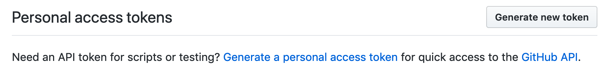
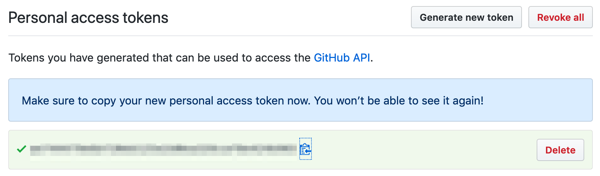
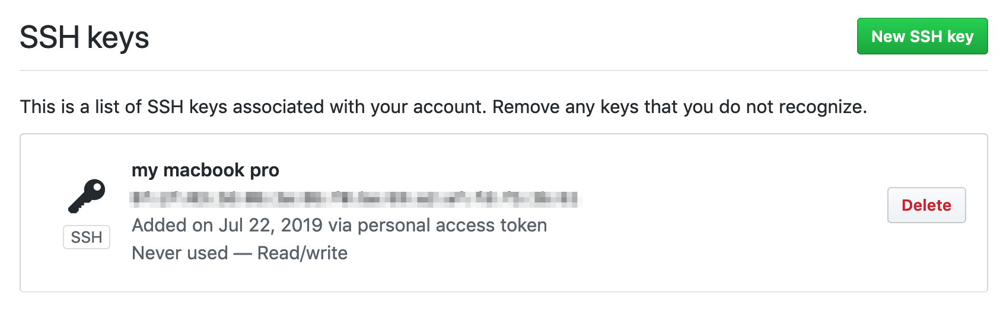

# GitHub Public-key Auto Register

An automation tool to register your public-key to GitHub.

## Install

```bash
npm install
```

## Usage

1. Set your GitHub ID and personal access token in the environment variables:

```bash
export GITHUB_USER_ID='your-id';
export GITHUB_TOKEN='your-access-token';
```

You will find your personal access token here:
https://github.com/settings/tokens



If you haven't generated a token yet or don't remember it, you can create a new one:



---

You can also provide your GitHub password instread of a token (not recommended):

```bash
export GITHUB_USER_ID='your-id';
export GITHUB_TOKEN='your-access-token';
```

2. Run

```bash
npm start -- --title="<description of the key>" --pubKeyPath="<path to pubkey>"
```

example:

```bash
npm start -- --title="my macbook pro" --pubKeyPath="/Users/me/.ssh/id_rsa.pub"
```

You'll see `your public key is successfully registered!` if process completes.

3. Your registered key will be on the list.

See the registered keys at https://github.com/settings/keys.




## Tests

```bash
npm test
```
